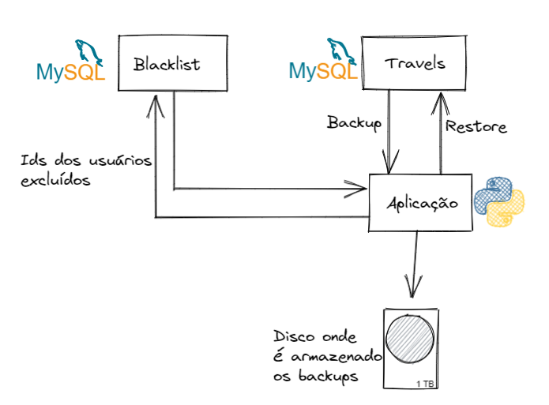

# Jéssica Isri Dias Cruz

Me chamo Jéssica Isri Dias Cruz, estudante, formando de Banco de Dados na Fatec São José dos Campos e formada em Técnico de Informatica, pela ETEC Machado de Assis em 2019.

Iniciei na area do TI desde 2017 quando realizei um estágio junto ao técnico de informatica. 

Em 2018 fui efetivada no cargo de desenvolvedor fullstack, porém atuava em atividades mais voltadas ao backend e processamento de dados financeiros provenientes de diversas fontes e construção de ‘bots’ com a função de WebScraping.

Em 2020 recebi a oportunidade de atuar como desenvolvedor fullstack na area de GIS, assim ganhando conhecimento nas aplicações baseadas em Google Maps. Posteriormente no fim do ano de 2020 e decorrer de 2021, iniciei atividades relacionadas a computação em nuvem, tendo como principal base o uso do Google Maps Plataform.

Atualmente busco conhecimento na area de big data e machine learning, no momento para além da finalizaçao da faculdade de banco de dados, oriento os meus estudos para a realização da prova de certificaçao do Google Data Engineer

  
  
  

# Meus Projetos
1. [WEBBOT](https://github.com/JessicaIsri/PortifolioApis/blob/main/readMe.md#webbot)
2. [GANTT PLANNER](https://github.com/JessicaIsri/PortifolioApis/blob/main/readMe.md#gantt-planner)
3. [Valcode](https://github.com/JessicaIsri/PortifolioApis/blob/main/readMe.md#valcode)
4. [Nemo](https://github.com/JessicaIsri/PortifolioApis/blob/main/readMe.md#nemo)
5. [Nemosys](https://github.com/JessicaIsri/PortifolioApis/blob/main/readMe.md#nemosys)
## Webbot

Ano: 2019.2

Parceiro: FATEC

  

O sistema em questão tinha como objetivo o desenvolvimento de um webbot que conseguisse solucionar um problema da atualidade. O problema a ser resolvido era de livre escolha dos participantes.
Tendo isso em mente a aplicação tem o objetivo de auxiliar na pesquisa de mercado para pequenas empresas da cidade de São José dos Campos, através da coleta de dados no portal da Receita Federal e com os dados de CEP localizar a latitude e longitude aproximada para além de dados adicionais do endereço, dessa forma sendo possivel a análise da concorrencia de um determinado estabelecimento num determinado ramo num local específico da cidade de São José dos Campos.

### Técnologias utilizadas na solução
As seguintes tecnologias foram adotadas na solução desenvolvida:
- Python: O python foi utilizado para a obtenção e processamento das planilhas fornecidas pela receita federal. Ele foi escolhido para essa tarefa por ser uma linguagem de programação poderosa para o processamento de dados além de apresentar uma curva de aprendizado relativamente baixa.
- Django: Django é um framework para desenvolvimento rápido para web, escrito em Python, que utiliza o padrão model-template-view. Ele foi utilizado na montagem de um site para a exibição dos resultados do processamento feito em cima dos dados citados anteriormente.
- Selenium: Selenium é um framework portátil para testar aplicativos web, porém foi aptado para emular um usuário realizando o download dos arquivos do site da receita federal.
- MongoDB: O MongoDB é um sistema de banco de dados NoSql orientado a documentos, que foi utilizado para armazenar os dados extraídos das planilhas da Receita Federal.

### Contribuições individuais/pessoais
Nesse projeto tive como contribuição o desenvolvimento do ‘bot’ que recuperava os arquivos fornecidos pela Receita Federal e as rotinas de leitura dos arquivos dos quais cada uma continha aproximadamente 5 GB de dados. Para além do método de recuperação dos dados espaciais através do dado do CEP.

O bot foi montao a partir de uma adptação de uma ferramenta de testes, o Selenium originalmente é utilizado para realizar teste em interface de usuário, porém pode ser utilizado para emular um utilizador realizando operações em sites que não sejam protegidos por login integrado ao ReCaptcha.

Para conseguir extrair os dados das planilhas, inicialmente foi necessário adquirir o conhecimento dos interators presentes no python, porém posteriormente foi utilizado a biblioteca pandas, que era capaz de manipular os dados através de seus dataframes. 

### Hard Skills Desenvolvidas:
Python: Sei fazer com autonomia.

Selenium:  Sei fazer com autonomia.

### Soft Skills Efetivamente Desenvolvidas:
Como softskills desenvolvidas, temos o aprendizado inicial do uso do scrum, mesmo que ainda longe de uma aplicaçao ideal, ainda sim tivemos a ideia de como se portavam cada papel e as suas principais funções. Para além não posso deixar de destacar as habilidades interpessoais adiquiridas, pois para o total desenvolvimento do projeto foi necessário aprender a trabalhar e se relacionar em equipe. Pois, desde a capacidade de reconhecer quando esta com dificuldade em algo, quanto a humildade de ajudar o colega.

## GANTT PLANNER

Ano: 2020.1

Parceiro: NECTO

  

Nossa parceira, a Necto Software, é uma empresa especializada em promover soluções de software.

O Gantt Planner surgiu da necessidade da empresa Necto, da qual precisava de uma ferramenta que fosse fácil de se utilizar, portatil e flexivel e conseguisse auxiliar no planejamento dos projetos presentes na empresa, visto que numa breve comparação com ferramentas semelhantes as mesmas sempre possuam algum fator dificultante, seja a visualização ou então a limitação do uso por todos os setores.
Logo o Gantt Planner nasceu com a proposta de ser uma ferramenta visual de planejamento, apesentando de forma gráfica os projetos e recursos disponíveis no momento.

### Técnologias utilizadas na solução
- Python: O python foi utilizado no backend junto ao Django, novamente foi escolhido pelo seu poder aliado a sua baixa curva de dificuldade, para além disso a empresa parceira também adota o python como sua principal ferramenta.
- Django: O Django foi utilizado para permitir o sistema web a partir do python, provendo o sistema de model-view-template.
- PostgreSql: O PostgreSql foi utilizado para armazenar os dados dos sistema (Colaboradores, Tasks ...). 
- Javascript, Html e Css: Foram utilizadas para construir a parte gráfica, animações e interações com o usuário. 

### Contribuições individuais/pessoais
Tive como principal contribuição a modelagem e administração das entidades presentes no banco de dados, onde as mesmas deveriam conseguir atender a necessidade de exibição do front.
Também contribui escrevendo as rotinas presentes nos CRUDS para relacionados a ação de gerenciar as tarefas e colaboradores.

### Hard Skills Desenvolvidas:
Python: Sei fazer com autonomia

PostgreSQL: Sei fazer com autonomia

### Soft Skills Efetivamente Desenvolvidas:
O enfoque desse projeto esteve voltado principalmente a atuação em time, tanto o respeito com os parceiros, quanto ao entendimento do real trabalho em time. Um ponto de destaque principal é o impacto da divisão de tarefas, saber assumir tarefas conforme a sua real capacidade de desenvolvimento. Junto a isso a priorização e levantamento de requisitos, representam a base de qualquer projeto, pois com essas informações é possível basear não só o banco de dados, mas toda a aplicação.

## Valcode

Ano: 2020.2

Parceiro: SPC

  

 O SPC é uma empresa já bem conhecia em nosso território nacional, responsável por fornecer uma das maiores ferramentas de proteção ao crédito, hoje ela detem informações sobre grande parte das transações que ocorrem no Brasil.

Esse projeto foi desenvolvido visando a capacidade de gerar valor aos usuários do Cadastro Positivo, clientes do SPC BRASIL.

O Valcode é uma plataforma cujo objetivo é o auxilio a saúde do seu score de crédito, visado prioritariamente as pessoas físicas, onde através de um sistema web é possível consultar o estado do seu crédito, além de conteúdos educativos sobre como melhorar seu score.

### Técnologias utilizadas na solução

Java - O java foi utilizado devido às especificações do projeto, sendo empregado junto ao SpringBoot para prover o backend da aplicação.

Spring Boot - O Spring Boot é um framework para java que permite o desenvolvimento web com base em apis REST e foi escolhido justamente por esse motivo, sendo usado para promover as APIS utilizadas no portal.

Oracle Database: O Oracle database é um SGDB, e foi utilizado para armazenar os dados de transações e cliente fornecidos pela empresa parceira.

Angular - O angular é um framework para Java Script, que tem como grandes benefícios a sua modularidade e produtividade, foi utilizado para codificar a interface de interação com o usuário.

### Contribuições individuais/pessoais
Nesse projeto atuei principalmente no backend, sendo responsável pela abstração das entidades do banco de dados para o codigo em Java, os CRUDS que permitiam a recepção dos dados e listagem das informações processadas.

No caso da listagem de informações, desenvolvi um filtro que fuincionava de forma genérica, ou seja, era informado a base que seria consultada, o campo desejado, a condição (igual, menor que, maior que, menor igual a, diferente ...)  e o valor buscado. O backend então recebia essas informações e com base nelas montava a busca em banco.

Para a inserção de dados, montei leitores de CSV para cada uma das planilhas fornecidas, transformando os dados em listas de dados e em seguidas os inserindo em banco através de uma unica transação para poder otimizar o tempo de requisição.

### Hard Skills Desenvolvidas:
Java: Sei fazer com autonomia

Oracle Database: sei fazer com ajuda 

SpringBoot: Sei fazer com autonomia

### Soft Skills Efetivamente Desenvolvidas:
Como softskills desenvolvidas ressalto a habilidade de priorizar o desenvolvimento de tarefas e comunicação efetiva entre times.

## Nemo
Ano: 2021.1

Parceiro: GSW

  

No primeiro semestre de 2021, no então 4º semestre, trabalhamos junto ao parceiro GSW em uma aplicação que tinha por objetivo o macth entre o candidato e o contratante para uma determinada vaga, com base nas skills e experiência do candidato.

### Técnologias utilizadas na solução

Java - O java foi utilizado devido às especificações do projeto, sendo empregado junto ao SpringBoot para prover o backend da aplicação.

Spring Boot - O Spring Boot é um framework para java que permite o desenvolvimento web com base em apis REST e foi escolhido justamente por esse motivo, sendo usado para promover as APIS utilizadas no portal.

Postigis: O postigis foi utilizado para armazenar dado espacial, foi escolhido por ser uma ferramenta completa e gratuita.

Google Directions: Foi utilizado para poder realizar o calculo de distancia e dificuldade para o colaborador chegar até o posto de trabalho.

### Contribuições individuais/pessoais
Nesse projeto em específico, fiquei responsável pelo sistema de cálculo do “score” que cada candidato apresentava para a vaga, ou seja, o quanto o candidato se encaixava na vaga a ser disputada.

Como um dos grandes problemas apresentados pelo cliente era a questão de distância e o valor que a empresa contratante precisaria desembolsar de vale-transporte, a aplicação era munida de um modulo de integração geoespacial e o uso de uma das muitas API’s disponibilizada pelo Google em especial o seu produto Directions.

Essa integração consistia no cálculo do quão “complexo” seria o transporte do candidato, para isso utilizei do retorno da API Google Directions. Nela era possível verificar qual a distância e tempo de locomoção, além de ter informações adicionais como, por exemplo: Quantos ônibus eram necessários e qual tempo dentro de cada um. 

Em adição ao sistema provido de geolocalização, também fui responsável pelo desenvolvimento das buscas avançadas por candidatos e oportunidades, utilizando do recurso de critérios.

Para a busca mais avançada o sistema consistia de uma busca ponderada, era inicialmente feito uma busca simples pelos critérios desejados para a vaga de maneira bem genérica. Em seguida com aquele resultado era aplicado uma logica de pesos, onde cada critério atendido da vaga adicionava uma pontuação pré configurada pelo recrutador, assim obtendo um rank de candidatos, dentro dos possíveis candidatos

### Hard Skills Desenvolvidas:
Java: Sei fazer com autonomia

Postgis: Sei fazer com autonomia

SpringBoot: Sei fazer sozino

Google Directions: Sei fazer com ajuda

### Soft Skills Efetivamente Desenvolvidas:
Como skill de destaque, devo ressaltar o desenvolvimento da capacidade analítica, como lidar com os dados retornados pela Directions, como usar esses dados ao nosso favor, como gerar valor numa série de métricas para o nosso cliente. Por mais do sistema não ser perfeito e acabar por cortar algumas pessoas da lista, ele acabava por apresentar um bom ranqueamento.

## Nemosys
Ano: 2021.2

Parceiro: NESS

  

c
Para o o 5 semestre tivemos como parceiros a empresa NESS, e o objetivo era o desenvolvimento de uma plataforma para o suporte ao ensino as distancia e oferta de conhecimento, sendo capaz de levantar métricas a partir do uso da plataforma.

### Técnologias utilizadas na solução

Python: O python foi utilizado para as rotinas ETL.

MongoDB: O MongoDb foi utilizado para armazenar os dados gerados pela ferramenta de chat.

BigQuery: O Bigquery foi utilizado como Datawarehouse.

Digital Ocean: Foi utilizado para a hospedagem do chat, e das imagens docker.

### Contribuições Pessoais
Nesse projeto estive mais envolvida na parte de infraestrutura e dev-ops, dentre as atividades desenvolvidas estão: 

Implantação de uma ferramenta de chat, utilizando os serviços de cloud da Digital Ocean e dependências em containers docker, tais como o MongoDB e seu sistema de replicação entre 3 instancias. Nesse caso em específico se tratavam de 3 imagens Docker que se comunicavam entre si.

Para a aplicação também utilizamos inicialmente uma imagem do SQLSever, porém devido a fatores de subutilização, foi adotado uma imagem de PostgreSql.

Adicionalmente, foi utilizado um pipeline de deploy automático, que se utilizava de um Container Repository da Digital Ocean, ou seja, era utilizado um repositório para as imagens docker geradas através do build do sistema, e no servidor onde a aplicação executava era utilizado uma tag para sempre utilizar a imagem mais recente, desse modo sempre que ocorria um merge aprovado para a master, automaticamente a aplicação era atualizada.

Por utilizarmos a Digital Ocean para hospedagem e execução, é necessário realizar a configuração de um token através dos secrets do github.

Uma vez configurado o secret, podemos apenas atualizar ou apagar o mesmo.

Junto da aplicação utilizamos um serviço de chat desenvolvido por terceiros e disponibilizado através de uma imagem docker, porém para o seu correto funcionamento o chat dependia da utilização de 3 instancias do mongo, uma primaria e duas replicas.

Para realizar tal feito sem a necessidade de se utilizar 3 VMs da Digital Ocean, foi configurado 3 services do mongo num arquivo docker-compose, utilizando uma rede para a comunicação entre eles.

### Hard Skills Desenvolvidas:

Java: Sei fazer com autonomia 

Git Workflow: Sei fazer com autonomia 

Docker: Sei fazer com autonomia 

Cloud Compute: Sei fazer com autonomia 

MongoDb: Sei fazer com ajuda

### Soft Skills Efetivamente Desenvolvidas:

Como soft skill tive o desenvolvimento da comunicação com o time de desenvolvimento, visto que não programava, porém, precisava dar suporte de infraestrutura as aplicações desenvolvidas.

## Lgpd Exclusion
Ano: 2022.1

Parceiro: Fatec

  

Com o avanço da popularidade de temas relacionados a aplicação da LGPD(Lei Geral da Proteção de Dados), algumas lacunas começaram a ganhar destaque,
dentre elas a preocupação relativa aos dados do usuário quando se é realizado um backup.

Citando como exemplo uma base de dados de uma agência de viagens, onde temos dados de usuários, destinos e viagens realizadas,
porém um usuário cadastrado solicita sua remoção da base, algo simples a princípio, entretanto um problema ocorre e é necessário o restore
do último backup realizado dessa base.

Nesse cenário hipotético o usuário que antes havia sido removido arrisca voltar a aparecer no banco de dados.

### Técnologias utilizadas na solução
Python: O python foi utilizado para o desenvolvimento da aplicação, com o acréscimo do Flask para poder montar os endpints
que controlam a requisição de Backup e Restore.

Mysql: O Mysql foi utilizado para o armazenamento de dados em duas instancias de banco separadas
onde uma recebia o blacklist e a outra os dados pertinentes ao negócio.

### Contribuições Pessoais

Por se tratar de um projeto individual pude atuar de ponta a ponta, logo tive a responsabilidade desde gerar os dados para o Mock
quanto o desenvolvimento e estruturação da aplicação.

A aplicação consiste basicamente de uma API em python responsavél por controlar as solicitações de backup e restore, scripts de conexão entre os bancos e scripts para a remoção pós restore dos usuários presentes na blacklist.

Uma vez que o usuário solicita sua remoção, antes de ser excluido, seu id é gravado em outro banco de dados chamado blacklist.

Toda vez que realizamos um restore, antes de disponibilizar a base para uso, um script recupera todos os ids do Blacklist e executa um comando de DELETE, passando esses ids como argumento. Dessa forma caso algum registro volte a existir de maneira indevida, ele será novamente apagado.

### Hard Skills Desenvolvidas:

Python: Sei fazer com autonomia

MySql: Sei fazer com autonomia

### Soft Skills Efetivamente Desenvolvidas:

Diferente dos projetos anteriores onde tinhamos muita interação em equipes, assim possibilitando softskills voltadas a essa convivência. Esse projeto trouxe principalmente a capacidade analitica externa a programação de fato, uma vez que para a correta aplicação da LGPD é necessário o estudo de conteudos jurídicos.

## Meus Principais Conhecimentos